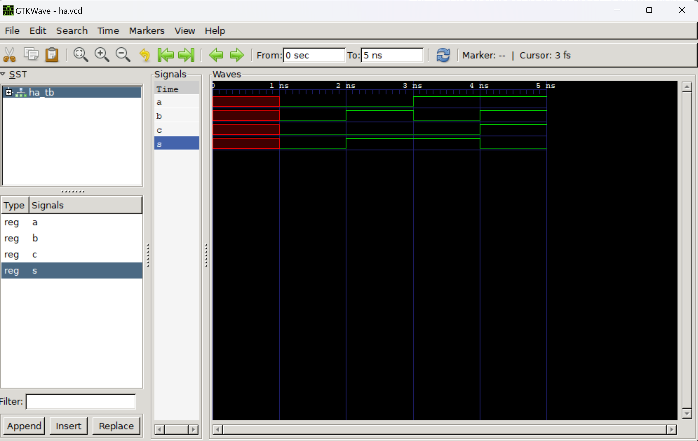

# Design-6-Labs
## Labs Completed by *Nate Dawson*

---

**Lab 1**
*GHDL and GTKWave*
- In this lab I downloaded the GHDL and GTKWAVE software to describe and simulate hardware examples
- This was completed with the tutorial by [Nerdy Dave](https://youtu.be/H2GyAIYwZbw?si=BPTJ1yH9rXGcyoHP)

1. Half Adder Example
```
$ ghdl -a ha.vhdl
$ ghdl -a ha_tb.vhdl
$ ghdl -e ha_tb
$ ghdl -r ha_tb --vcd=ha.vcd
ha_tb.vhdl:47:5:@5ns:(assertion error): Reached end of test
$ gtkwave ha.vcd
```
     
