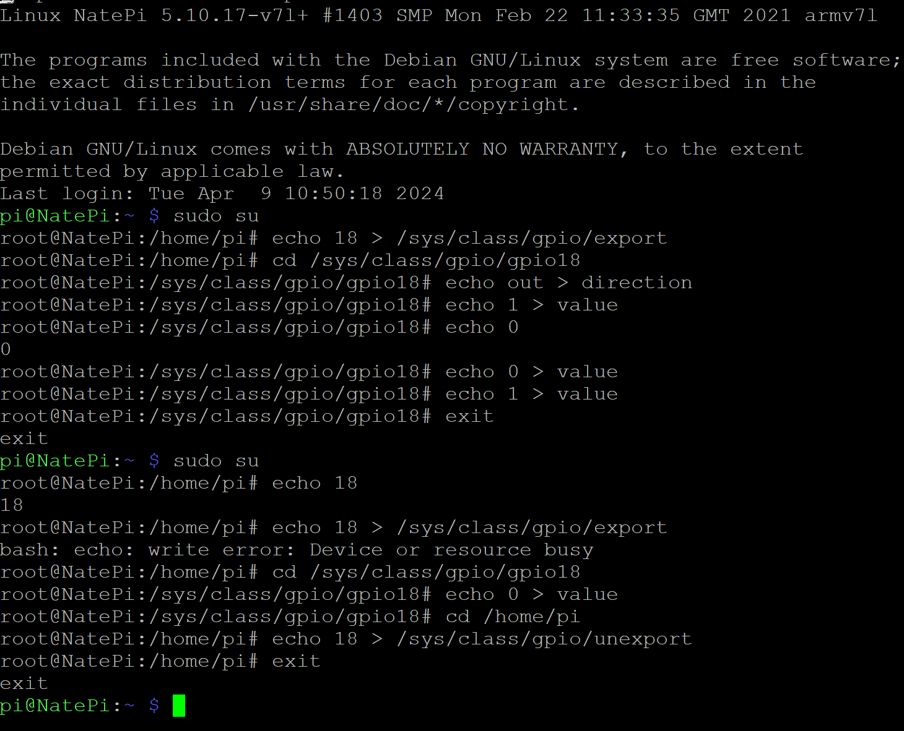

# Design-6-Labs
## Labs Completed by *Nate Dawson*

---

**Lab 1**
*GHDL and GTKWave*
- In this lab I downloaded the GHDL and GTKWAVE software to describe and simulate hardware examples
- This was completed with the tutorial by [Nerdy Dave](https://youtu.be/H2GyAIYwZbw?si=BPTJ1yH9rXGcyoHP)

1. Half Adder Example
   - I downloaded the half adder and half adder test bench vdhl code from the resources
   - These were opened through notepad to compile the code
   - There were no errors during this process
   - Through the windows terminal the following commands launched the compiled code through *GTKWAVE*
     

     

2. D Flip-Flop Example
   - For the second example I chose to use the D Flip-Flop
   - The codes were accessed and compiled using the same method
   - There were no errors during this process
   - Through the windows terminal the following commands launched the compiled code through *GTKWAVE*
   

     

**Lab 2**
*Raspberry Pi*
1.  In this lab I connected my Rasberry Pi 4b to my computer through SSH connection hosted by the Putty application
   - The connection works by connecting both my computer and my Raspberry Pi to my mobile hotspot
   - Then by giving Putty the IP address of the Pi I am able to log in and type commands in the terminal of my Pi from my computer


2. From the remote terminal I: 
   - disabled the serial communication by booting the command line and removing "console=serial0,115200"
   - installed ATP with the commands
```
$ sudo apt update
$ sudo apt install minicom
$ man minicom
$ minicom -b 115200 -o -D /dev/ttyS0
```


3. I also connected up an LED to the GPIO18 pin win a 100 Ohm resistor to then run the commands shown in the terminal to manually toggle the LED





**Lab 3**
*Python*
1. In this lab I used the connection established from the previous lab to pull and run python code directly from the terminal of the Pi
   - This was done with the commands:
```
$ cd
$ git clone https://github.com/kevinwlu/iot.git
$ cd iot
$ cd lesson3
```

2. Then after wireing up the GPIO18 just like in the last lab I used the Blink code from the repository to blink the LED automatically


